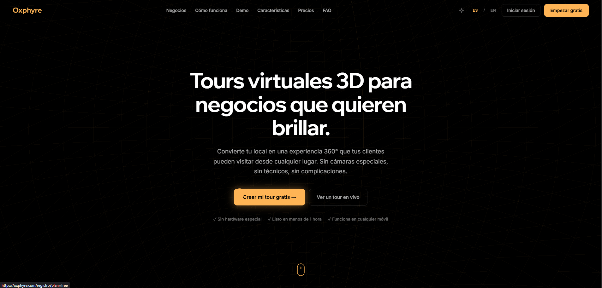
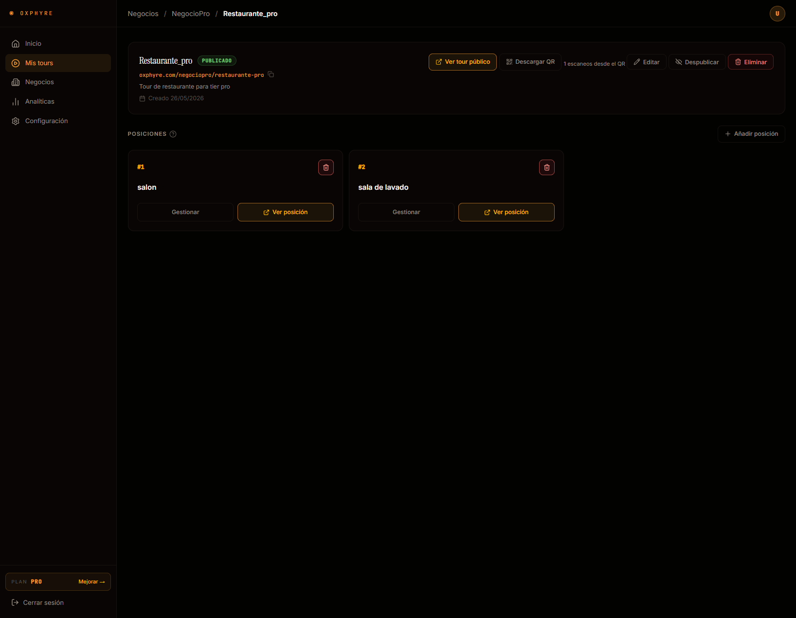
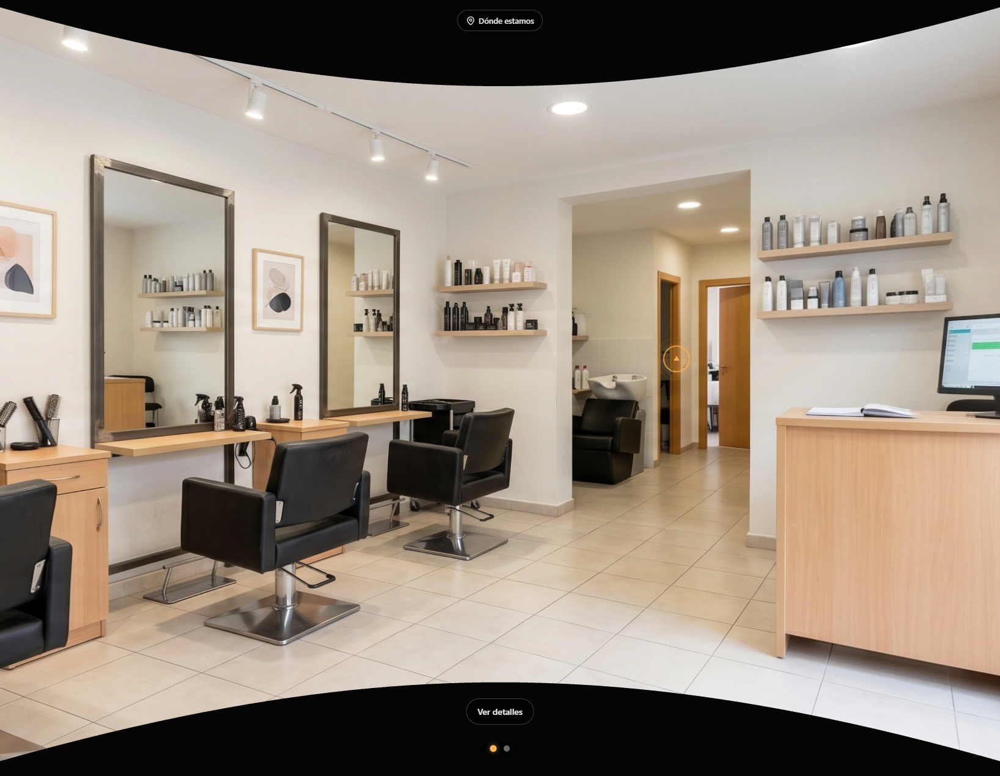
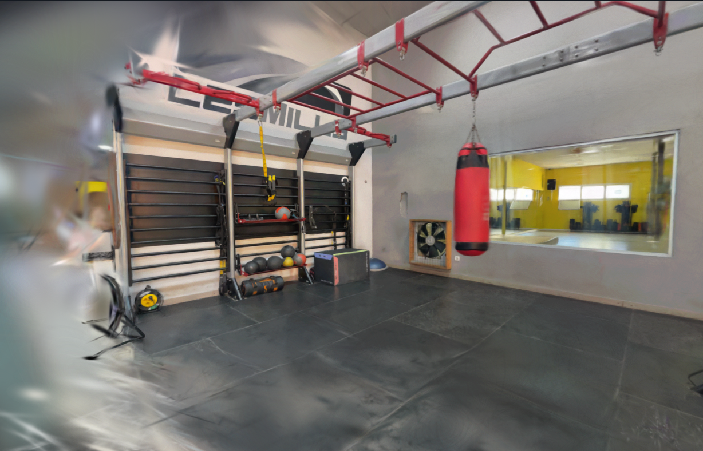
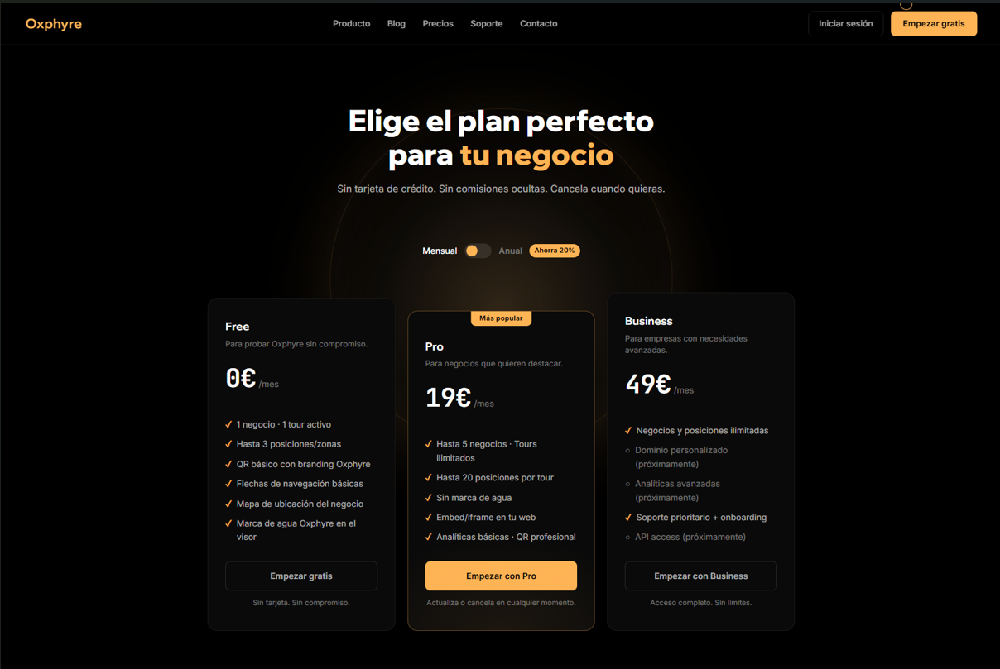
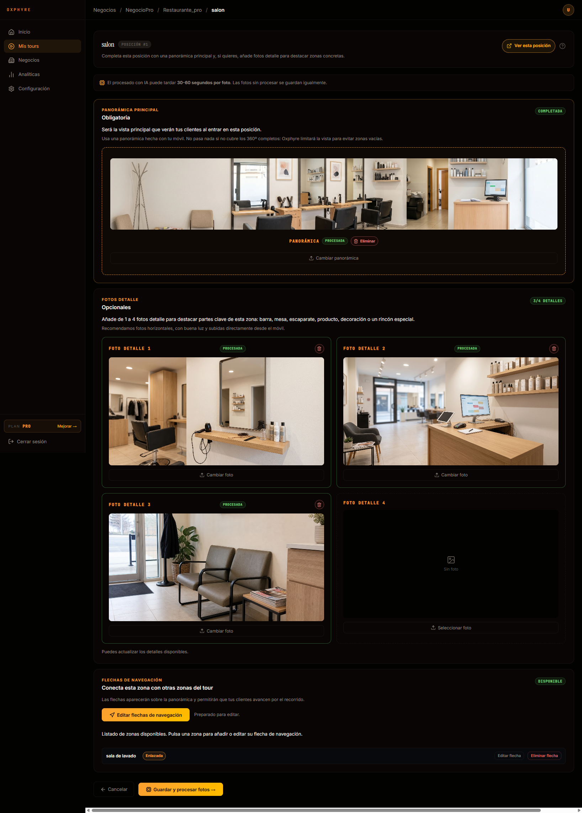
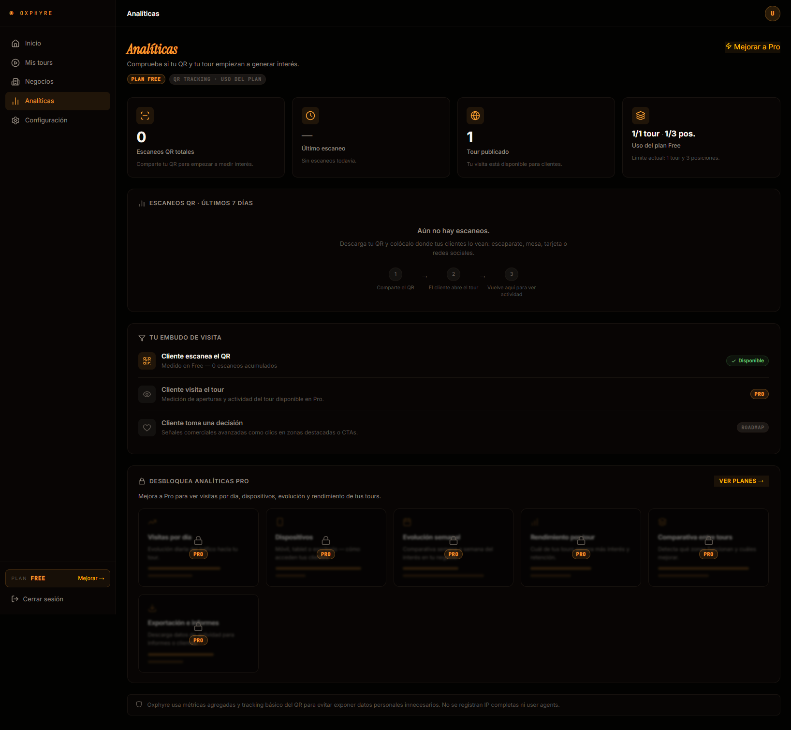
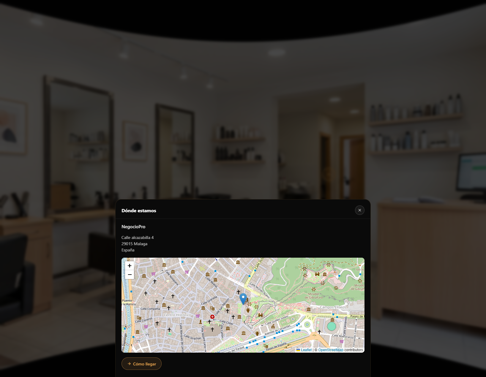
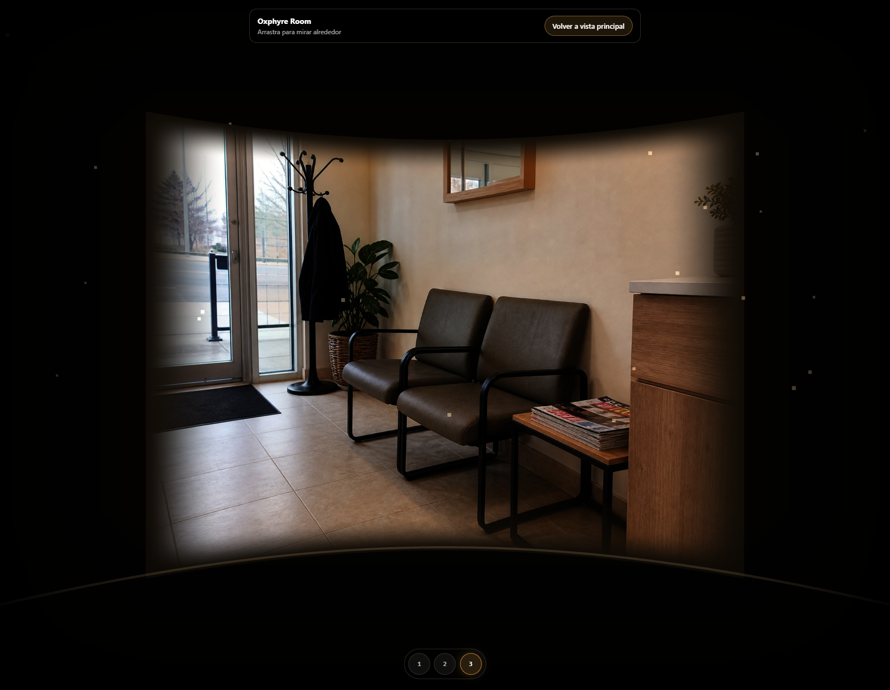

# Oxphyre

Immersive virtual tour SaaS platform for local businesses.

> **DAW Final Project:** Oxphyre was developed as my final project for Web Application Development (DAW). It was built as an AI-assisted software project, using tools such as Claude Code, ChatGPT and Codex to explore, implement and iterate on features while learning about full-stack architecture, authentication, image processing, deployment and immersive web experiences. My role focused on defining the product idea, designing the user flows, guiding the implementation, testing features, reviewing decisions, deploying the project and documenting the result.

> **Project status:** Oxphyre was developed and deployed as a functional academic MVP with its own domain and HTTPS. The project is currently presented as a portfolio/academic project, not as an active commercial SaaS product.

---

## Overview

Oxphyre is a SaaS-style web application designed to help small local businesses create and share immersive virtual tours of their physical spaces.

The idea behind the project is to give restaurants, gyms, clinics, barbershops, accommodation businesses and other local spaces a simple way to show their venue online through a public web tour accessible from a browser, shareable link or QR code.

The platform includes public marketing pages, user authentication, a private dashboard, business and tour management, image upload flows, public virtual tour viewing and basic analytics depending on the user plan.

---

## Screenshots

### Landing Page — Hero Section



### Dashboard — Business and Virtual Tour Management



### Oxphyre Room — Panoramic Viewer



### Roadmap — Gaussian Splatting Test



<details>
<summary>More screenshots</summary>

### SaaS Pricing Plans



### Dashboard — Image Management



### Dashboard — Tour Analytics



### Oxphyre Room — Business Location Map



### Oxphyre Room — Detail View



</details>
---

## Main Features

- Public landing page and informational pages.
- User registration, login and password recovery.
- Private user dashboard.
- Business management.
- Virtual tour creation.
- Tour positions and image management.
- Public immersive tour viewer built with JavaScript and Three.js.
- Public shareable tour URLs.
- Downloadable QR codes for sharing tours offline.
- Free and Pro analytics logic.
- SaaS-style product plan structure.
- Responsive design for desktop, tablet and mobile.
- Image storage flow prepared for Cloudflare R2.
- Production deployment with domain and HTTPS.

---

## Tech Stack

### Backend

- PHP 8.1
- Custom MVC architecture
- Front Controller pattern
- MySQL 8
- PDO prepared statements
- Composer
- PHPMailer

### Frontend

- HTML5
- CSS3
- JavaScript
- Three.js
- Responsive layout

### Storage / Media

- Cloudflare R2 integration prepared for final WebP tour images
- Local upload flow for development/testing
- Image processing service integration

### Python Service

- Python
- Flask
- MiDaS-based image processing prototype

### Deployment

- AWS EC2
- Nginx
- PHP-FPM
- HTTPS
- Custom domain
- Cloudflare

---

## Architecture

```txt
oxphyre/
├── backend/          # PHP backend: controllers, models, services and routing logic
├── public/           # Public web root: entry point, assets, JavaScript, CSS and viewer
├── python-service/   # Flask/MiDaS image processing service prototype
├── scripts/          # Utility and deployment-related scripts
├── docs/             # Project documentation and internal notes
├── .env.example      # Environment variable template
├── composer.json     # PHP dependencies
└── README.md
```

### Backend

The backend follows a custom MVC-style structure built in PHP.

It handles:

- routing and controllers,
- database access through models,
- user authentication,
- business and tour ownership validation,
- CSRF protection,
- dashboard data,
- tour creation and management,
- QR analytics,
- contact and email flows,
- integration with storage and image processing services.

### Public Layer

The `public/` directory acts as the browser-accessible entry point of the application.

It includes:

- public pages,
- the front controller entry point,
- CSS and JavaScript assets,
- the immersive tour viewer,
- QR/public tour routes,
- static assets required by the interface.

### Python Service

The Python service was created as an experimental image-processing component using Flask and MiDaS.

It was designed to support advanced media processing workflows and communicate with the PHP application through an internal service endpoint protected by a shared token.

---

## Virtual Tour Flow

The core product flow is based on creating a business, adding a virtual tour and defining the positions/images that form the experience.

Main flow:

1. The user registers or logs in.
2. The user creates a business profile.
3. The user creates a virtual tour for that business.
4. The user uploads images and defines positions.
5. Oxphyre generates a public tour URL.
6. The tour can be shared through a public link or downloadable QR code.
7. Visitors can open the tour in a browser and explore the space through the immersive viewer.
8. Analytics are collected depending on the user plan.

---

## Product Plans

Oxphyre was designed with a SaaS model based on different plan levels.

### Free

Entry-level plan with basic limits, intended to let users test the product and publish a simple virtual tour.

### Pro

Professional plan with more capacity, improved tour presentation and analytics features.

### Business

Premium evolution of the product concept, intended for more advanced business needs such as white-label options, advanced analytics and future immersive technologies.

The Business plan was planned as part of the product roadmap and concept design.

---

## Security

The project applies several basic security practices expected in a web application MVP:

- PHP sessions.
- Hashed passwords.
- PDO prepared statements.
- CSRF protection in sensitive forms.
- Ownership and permission validation.
- Private environment variables through `.env`.
- `.env.example` included as a safe template.
- HTTPS in production.
- Sensitive credentials excluded from the repository.
- Internal Python service protected through a shared service token.

---

## Environment Variables

The project uses environment variables for database credentials, application keys, email configuration, Python service access and Cloudflare R2 settings.

The real `.env` file is intentionally excluded from the repository.

Use the included template:

```txt
.env.example
```

and copy it locally as:

```txt
.env
```

Then fill the required values for the local or production environment.

---

## Current Limitations

This project was built as an academic MVP and final DAW project, so some parts were intentionally simplified or left as future improvements:

- It is not currently operated as a real commercial SaaS product.
- Payment processing and subscription billing were planned as roadmap features.
- Some Business plan features were designed conceptually but not fully implemented.
- The Python/MiDaS service was experimental and not a production-grade media pipeline.
- A production version would require stronger observability, automated testing, refined deployment workflows, background jobs, storage lifecycle policies and a complete billing system.
- Future immersive features such as Gaussian Splatting were considered as part of the product evolution roadmap.

---

## What I Learned

Through Oxphyre I practiced and explored:

- Designing a SaaS-style product from an initial idea to a working MVP.
- Structuring a custom PHP MVC application.
- Building authentication and private dashboard flows.
- Working with MySQL and PDO.
- Managing ownership and permissions for user-created resources.
- Creating public/private routes and separating dashboard logic from public tour access.
- Building an immersive virtual tour viewer with JavaScript and Three.js.
- Preparing image storage workflows with Cloudflare R2.
- Connecting a PHP application with a Python microservice.
- Deploying a multi-part web application on AWS EC2 with Nginx and PHP-FPM.
- Using AI-assisted development tools to iterate, review and understand a larger codebase.
- Documenting technical decisions and project evolution.

---

## Academic Context

Oxphyre was developed as my final project for DAW.

The goal was not only to create a website, but to build a realistic software product prototype that combined:

- public marketing pages,
- user authentication,
- private dashboard workflows,
- database-backed resource management,
- immersive web experiences,
- QR-based sharing,
- analytics logic,
- cloud storage preparation,
- deployment,
- and a roadmap for future 3D/immersive technologies.

---

## Author

Daniel Martínez Martos

Final project for Web Application Development (DAW), 2024-2026.
